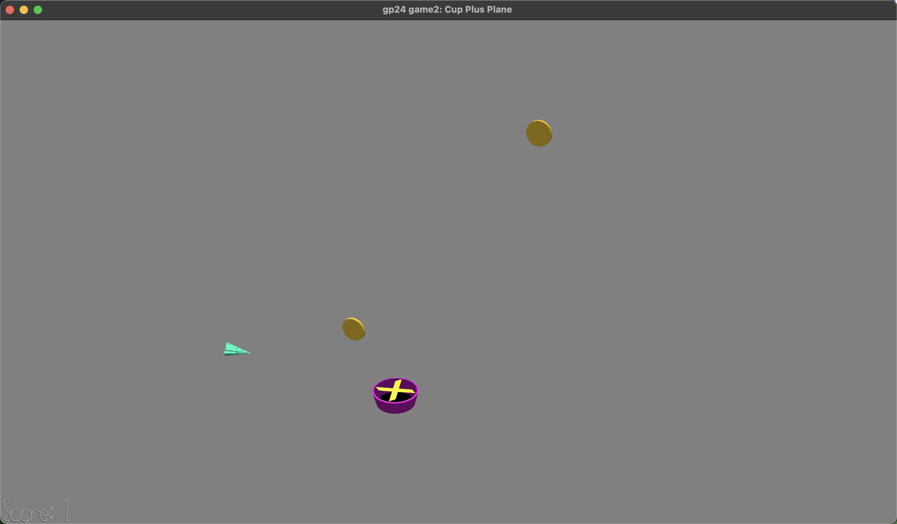

# Cup Plus Plane

Author: Messi Tu

Design: The game idea comes from flappy bird but players need to collect coins instead of avoid obstacles. Also players need to control the position of the cup fan to affect the position of the plane.

Screen Shot:

How To Play:

Press key A and D to move the cup fan left and right. 
Press Space key to increase the fan speed so that the plane will be blown up. 
The goal is to collect as many coins as possible to get a higher score.

This game was built with [NEST](NEST.md).
